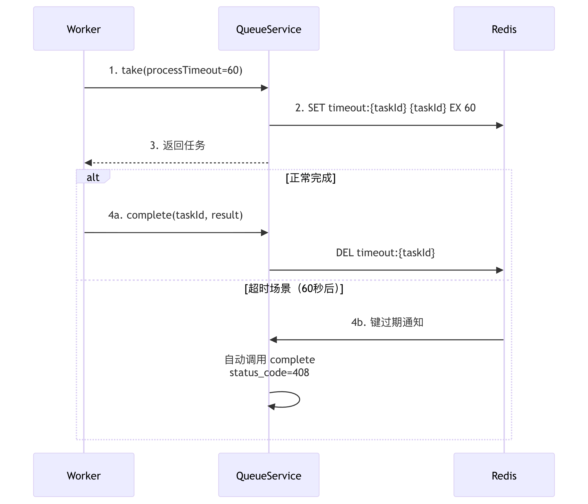

# 任务超时自动完成机制设计方案

## 一、背景与问题

### 1.1 当前架构问题

在当前的 Bella Queue 系统中，任务的生命周期存在以下问题：

- **任务被 take 后无超时控制**：Worker崩溃或处理超时，任务会一直挂起
- **无法自动处理超时任务**：缺少超时后的自动完成机制
- **Worker 崩溃导致任务永久丢失**：没有超时保护机制

### 1.2 业务需求

需要实现一个任务超时自动完成功能，满足以下要求：

1. take接口增加 processTimeout 参数，代表预期任务完成时间（秒）
2. 如果 processTimeout 时间内没有收到 complete 回执，自动调用 complete 接口标记任务超时完成
3. **利用 Redis 键自动过期机制**，无需复杂的状态管理

---

## 二、设计方案

### 2.1 核心思路

**利用 Redis 键过期机制实现任务超时控制**：
- Take 时创建带 TTL 的超时键
- Complete 时删除超时键
- 超时键过期时：自动调用 complete 接口，状态码设为 408（Request Timeout）

### 2.2 架构设计



---

## 三、Redis 数据结构设计

### 3.1 现有数据结构

```
{queue}                        // 主队列 (Sorted Set, score=startTime)
{queue}:metadata:{taskId}      // 任务元数据 (String, JSON格式, 24小时TTL)
```

### 3.2 新增数据结构

```
timeout:{taskId}               // 超时控制键 (String, 带TTL)
  - value: taskId              // 存储任务ID
  - TTL: processTimeout秒      // 过期时间由take接口的processTimeout参数指定
```

**设计要点**：

- **超时键**：使用 String 类型带 TTL，Redis 自动过期触发超时处理
- **自动清理**：任务完成时删除超时键
- **高性能**：纯内存操作，利用 Redis 原生过期机制

---

## 四、核心流程设计

### 4.1 Take 流程改造

#### 接口变更

Take 对象新增字段：
- `processTimeout`（超时时间，秒）：可选，指定任务的预期完成时间

#### 实现流程

**步骤：**
1. 执行原有 take 逻辑，获取任务列表
2. 过滤已过期和已取消的任务
3. 如果 `processTimeout != null && processTimeout > 0`：
   - 使用 Redis Pipeline 批量设置超时键
   - 每个任务设置：`SET timeout:{taskId} {taskId} EX {processTimeout}`
4. 返回任务

**实现位置：** `QueueService.take()` 方法，调用 `trackProcessTimeout()` 设置超时键

### 4.2 Complete 流程改造

#### 实现流程

**步骤：**
1. 删除超时键：`DEL timeout:{taskId}`
2. 执行原有 complete 逻辑
3. 删除任务元数据

**实现位置：** `QueueService.complete()` 方法，开头调用 `deleteTimeoutKey()`

### 4.3 超时处理机制

#### Redis Keyspace Notifications

**配置 Redis：**
```bash
CONFIG SET notify-keyspace-events Ex
```

或在 redis.conf 中配置：
```
notify-keyspace-events Ex
```

#### 监听器实现

**实现方式：**
- 在 `QueueService.init()` 中启动守护线程监听 Redis 键过期事件
- 监听 `__keyevent@0__:expired` 频道
- 过滤处理 `timeout:*` 格式的键
- 提取 taskId 并异步提交超时处理任务

**设计要点：**

1. **守护线程**：设置为 daemon 线程，JVM 退出时自动结束
2. **异步处理**：使用 `TaskExecutor.submit()` 异步处理超时，避免阻塞订阅线程
3. **自动重连**：`while(true)` 循环确保连接断开后自动重连
4. **异常容错**：连接失败后等待 5 秒再重试

**优点**：
- 实时响应，延迟低（秒级）
- 无需轮询，资源消耗小
- Redis 原生支持

**注意事项**：
- 需要配置 Redis keyspace notifications
- 过期事件可能丢失（Redis 不保证必达）
- complete 方法需要幂等处理

### 4.4 超时任务处理

**处理步骤：**
1. 构造超时结果：
   ```json
   {
     "status_code": "408",
     "request_id": "{taskId}"
   }
   ```
2. 调用 complete 接口，标记任务完成
3. 删除超时键（complete 方法内已处理）
4. 记录错误日志

**实现方式：**
- 超时完成时：任务状态为 succeeded，但 status_code 为 408
- 在监听器的回调中异步调用 complete 方法

---

**文档版本**: v4.0
**创建日期**: 2026-01-12
**修改日期**: 2026-01-14
**作者**: Bella Queue Team
**审核状态**: 已实现
**变更说明**: 简化为仅包含超时机制，移除重试功能
