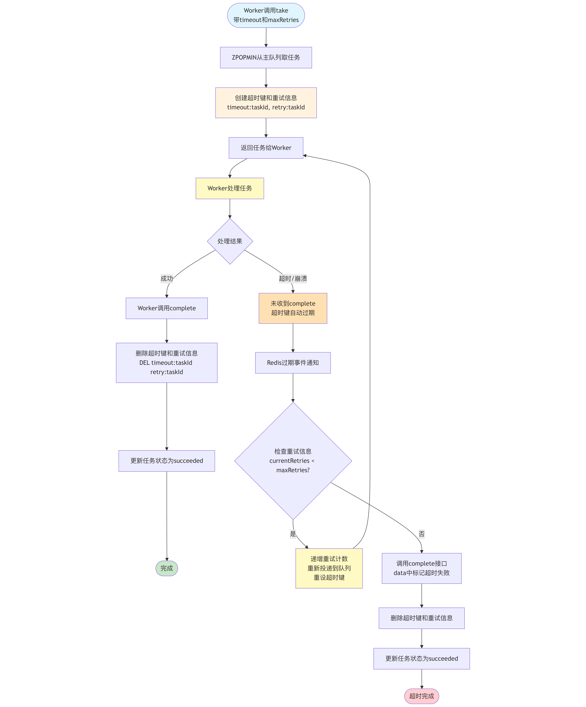

# 任务超时自动完成机制设计方案

## 一、背景与问题

### 1.1 当前架构问题

在当前的 Bella Queue 系统中，任务的生命周期存在以下问题：

- **任务被 take 后无超时控制**：Worker崩溃或处理超时，任务会一直挂起
- **无法自动处理超时任务**：缺少超时后的自动完成机制
- **Worker 崩溃导致任务永久丢失**：没有超时保护机制

### 1.2 业务需求

需要实现一个任务超时自动完成功能，满足以下要求：

1. take接口增加timeout参数，代表预期任务完成时间（秒）
2. take接口增加maxRetries参数（可选），代表超时后的最大重试次数
3. 如果timeout时间内没有收到complete回执：
   - 如果还有剩余重试次数，重新投递到队列
   - 如果重试次数已用完，调用complete接口标记任务完成，在数据体中标记失败原因
4. **利用Redis键自动过期机制**，无需复杂的状态管理

---

## 二、设计方案

### 2.1 核心思路

**利用 Redis 键过期机制实现任务超时控制和重试**：
- Take时创建带TTL的超时键，记录重试配置信息
- Complete时删除超时键和重试信息
- 超时键过期时：
  - 检查当前重试次数
  - 如果未达到最大重试次数，重新投递到队列（递增重试计数）
  - 如果已达到最大重试次数，调用complete接口完成任务，在数据体中标记超时失败

### 2.2 架构设计



---

## 三、Redis 数据结构设计

### 3.1 现有数据结构

```
{queue}                        // 主队列 (Sorted Set, score=startTime)
{queue}:metadata:{taskId}      // 任务元数据 (Hash)
```

### 3.2 新增数据结构

```
timeout:{taskId}               // 超时控制键 (String, 带TTL)
  - value: taskId              // 存储任务ID
  - TTL: timeout秒             // 过期时间由take接口的timeout参数指定

retry:{taskId}                 // 重试信息 (Hash)
  - currentRetries: N          // 当前已重试次数
  - maxRetries: M              // 最大重试次数
  - timeout: X                 // 超时时间（秒）
```

**设计要点**：

- **超时键**：使用String类型带TTL，Redis自动过期触发超时处理
- **重试信息**：使用Hash类型存储重试配置和状态
- **自动清理**：任务完成时删除超时键和重试信息
- **高性能**：纯内存操作，利用Redis原生过期机制

---

## 四、核心流程设计

### 4.1 Take 流程改造

#### 接口变更

Take 对象新增字段：
- `timeout`（超时时间，秒）：可选，指定任务的预期完成时间
- `maxRetries`（最大重试次数）：可选，指定超时后的最大重试次数，默认为0（不重试）

#### 新流程

**步骤：**
```
1. ZPOPMIN({queue})
2. 如果 timeout != null && timeout > 0：
   2.1 SET timeout:{taskId} {taskId} EX {timeout}
   2.2 如果 maxRetries != null && maxRetries > 0：
       HMSET retry:{taskId} currentRetries 0 maxRetries {maxRetries} timeout {timeout} queue {queue}
   2.3 记录日志：任务 {taskId} 设置超时 {timeout}秒，最大重试 {maxRetries}次
3. 返回任务
```

**实现方式：**
- 在原有take逻辑后增加超时键和重试信息设置
- 使用 SET with EX option 设置超时键（单位：秒）
- 使用 HMSET 记录重试配置信息
- 关键操作：
  - `SET timeout:{taskId} {taskId} EX {timeout}`
  - `HMSET retry:{taskId} currentRetries 0 maxRetries M timeout X`

### 4.2 Complete 流程改造

#### 新流程

**步骤：**
```
1. DEL timeout:{taskId} retry:{taskId}
2. 更新数据库状态（offline队列）
3. 删除 {queue}:metadata:{taskId}
```

**实现方式：**
- 在原有complete逻辑前删除超时键和重试信息
- 关键操作：`DEL timeout:{taskId} retry:{taskId}`（同时删除两个键）

### 4.3 超时处理机制

#### Redis Keyspace Notifications

**配置Redis：**
```bash
CONFIG SET notify-keyspace-events Ex
```

**实现方式：**
- 实现 KeyExpirationEventMessageListener 监听器
- 监听 Redis 键过期事件
- 过滤处理 `timeout:*` 格式的键
- 提取 taskId 并调用超时处理逻辑

**优点**：
- 实时响应，延迟低（秒级）
- 无需轮询，资源消耗小
- Redis原生支持

**缺点**：
- 需要配置Redis keyspace notifications
- 过期事件可能丢失（Redis不保证必达）
- 需要处理重复事件（需要幂等处理）


### 4.4 超时任务处理（含重试逻辑）

**处理步骤：**
```
1. 检查任务是否已完成（防止重复处理）
2. 获取重试信息：HGETALL retry:{taskId}
3. 判断是否需要重试：
   3.1 如果没有重试信息或 currentRetries >= maxRetries：
       - 调用 complete 接口，data 中包含：
         {
           "status": "failed",
           "reason": "timeout",
           "retries": currentRetries
         }
       - DEL timeout:{taskId} retry:{taskId}
       - 记录监控指标
   3.2 如果 currentRetries < maxRetries：
       - HINCRBY retry:{taskId} currentRetries 1  // 递增重试计数
       - 重新投递任务到队列：ZADD {queue} {score} {taskId}
       - 重新设置超时键：SET timeout:{taskId} {taskId} EX {timeout}
       - 记录重试日志
```

**实现方式：**
- 从Redis读取重试配置信息
- 根据当前重试次数决定重新投递或调用complete接口
- 超时完成时：任务状态为succeeded，但data中标记失败信息
- 重新投递时保持原有任务数据和metadata不变
- 关键操作：
  - `HGETALL retry:{taskId}` 获取重试信息
  - `HINCRBY retry:{taskId} currentRetries 1` 递增重试计数
  - `ZADD {queue} {score} {taskId}` 重新投递到队列
  - `SET timeout:{taskId} {taskId} EX {timeout}` 重设超时键
  - 超时完成：`queueService.complete(taskId, {"status":"failed", "reason":"timeout"})`

---

## 五、使用说明

### 5.1 接口使用

**Take接口参数：**
- `timeout`（可选）：超时时间（秒），未设置或为null/0时不启用超时控制
- `maxRetries`（可选）：最大重试次数，默认为0（不重试）

**使用场景：**

1. **仅超时控制，不重试**
   - 设置 `timeout`，不设置 `maxRetries` 或设为0
   - 超时后调用complete接口，任务状态为succeeded，data中包含失败信息

2. **超时后自动重试**
   - 同时设置 `timeout` 和 `maxRetries`
   - 超时后自动重新投递到队列，最多重试 `maxRetries` 次
   - 重试次数用完后调用complete接口，任务状态为succeeded，data中包含失败信息

3. **不使用超时机制**
   - 不设置 `timeout` 参数
   - 保持原有行为，任务不会超时

**注意事项：**
- 超时任务最终状态都是 `succeeded`，不会有 `failed` 状态
- 失败信息体现在 complete 的 data 字段中，例如：`{"status":"failed", "reason":"timeout", "retries":3}`
- 需要通过解析 data 字段来判断任务是否因超时失败
---

**文档版本**: v3.0
**创建日期**: 2026-01-12
**修改日期**: 2026-01-13
**作者**: Bella Queue Team
**审核状态**: 待审核
**变更说明**: 在超时机制基础上增加自动重试功能
